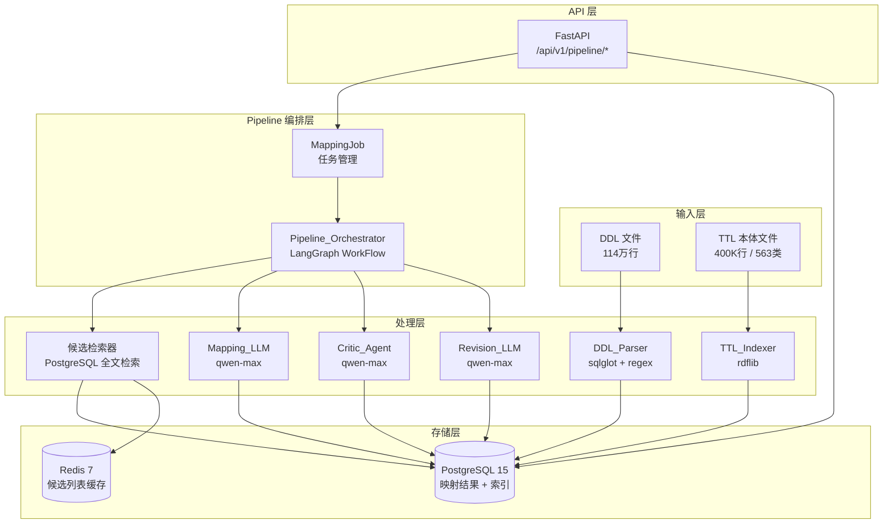
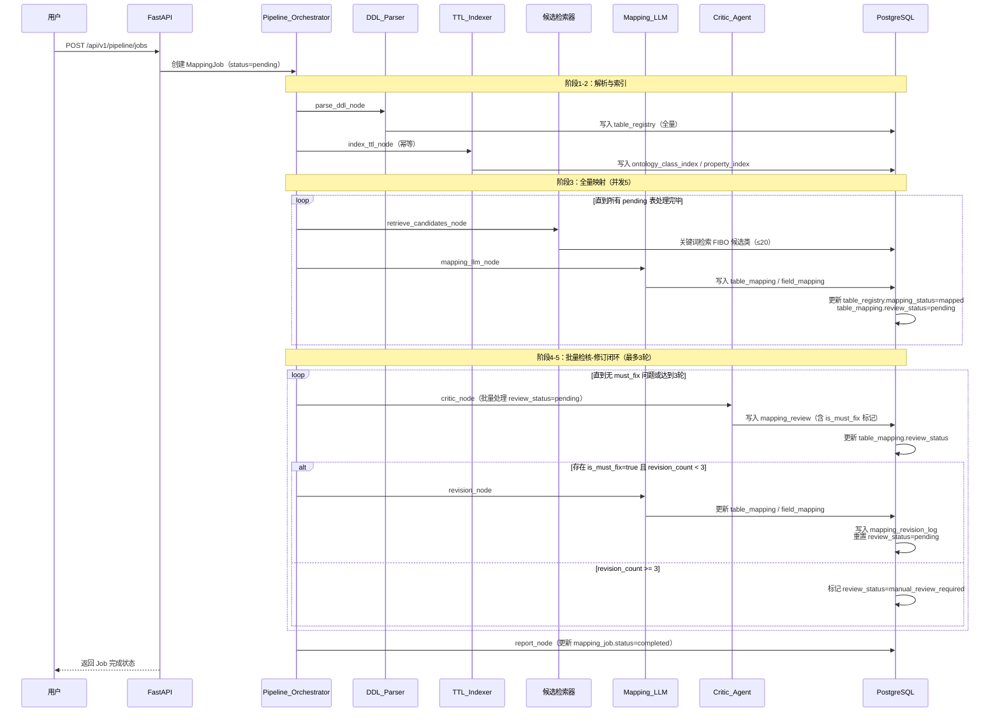

# 技术设计文档：DDL-FIBO 映射 Pipeline

## 1. 概述

本文档描述 BIPV5 源系统 DDL 到 SASAC_GOV_v4.4 FIBO 本体自动化映射 Pipeline 的技术设计。

### 1.1 背景与目标

现有 242 个 TTL 映射文件中 227 个为空占位符，数据从未真正入库。新 Pipeline 采用"映射关系存入 PostgreSQL → ETL 时查映射表动态生成三元组"的架构，将映射规则与数据彻底分离。

**核心目标**：
- 自动解析 BIPV5 的 77 个数据库、16,612 张表的 DDL 文件
- 将 400K 行 TTL 本体预处理为结构化索引，支持语义检索
- 通过 LLM（qwen-max/qwen-turbo）执行表→FIBO 类映射
- 通过 Critic Agent 进行多维度检核，最多 3 轮修订闭环
- 支持断点续跑、进度查询、结果导出

### 1.2 技术栈

| 层次 | 技术选型 |
|------|---------|
| Web 框架 | FastAPI + Python 3.11 |
| 工作流引擎 | LangGraph 0.2.x |
| 数据库 ORM | SQLAlchemy 2.0 async + asyncpg |
| 数据库 | PostgreSQL 15 |
| TTL 解析 | rdflib 7.x |
| DDL 解析 | sqlglot 23.x（主）+ regex（兜底） |
| LLM | 阿里云 DashScope API（qwen-max / qwen-turbo） |
| 数据校验 | Pydantic v2 |
| 异步任务 | asyncio + asyncio.Semaphore（并发控制） |
| 缓存 | Redis 7（候选列表缓存） |


---

## 2. 系统架构

### 2.1 整体架构图



### 2.2 数据流向




---

## 3. 数据库设计

### 3.1 表结构总览

```
PostgreSQL
├── table_registry          # DDL 解析结果，每张源表一条记录
├── ontology_class_index    # TTL 本体类索引
├── ontology_property_index # TTL 本体属性索引
├── ontology_index_meta     # TTL 索引版本管理
├── mapping_job             # Pipeline 任务管理
├── table_mapping           # 表级映射结果（表 → FIBO 类）
├── field_mapping           # 字段级映射结果（字段 → FIBO 属性）
├── mapping_review          # 检核意见
├── mapping_revision_log    # 修订历史
└── llm_call_log            # LLM 调用日志
```

### 3.2 核心表 DDL

```sql
-- DDL 解析结果
CREATE TABLE table_registry (
    id              BIGSERIAL PRIMARY KEY,
    database_name   VARCHAR(128) NOT NULL,
    table_name      VARCHAR(256) NOT NULL,
    raw_ddl         TEXT NOT NULL,
    parsed_fields   JSONB NOT NULL DEFAULT '[]',
    mapping_status  VARCHAR(32) NOT NULL DEFAULT 'pending',
    -- pending / mapped / unmappable / llm_parse_error
    parse_error     TEXT,
    created_at      TIMESTAMPTZ NOT NULL DEFAULT NOW(),
    updated_at      TIMESTAMPTZ NOT NULL DEFAULT NOW(),
    is_deleted      BOOLEAN NOT NULL DEFAULT FALSE,
    UNIQUE (database_name, table_name)
);
CREATE INDEX idx_table_registry_status ON table_registry(mapping_status);
CREATE INDEX idx_table_registry_db ON table_registry(database_name);

-- 本体类索引
CREATE TABLE ontology_class_index (
    id              BIGSERIAL PRIMARY KEY,
    class_uri       VARCHAR(512) NOT NULL UNIQUE,
    label_zh        VARCHAR(256),
    label_en        VARCHAR(256),
    comment_zh      TEXT,
    comment_en      TEXT,
    parent_uri      VARCHAR(512),
    namespace       VARCHAR(256),
    search_vector   TSVECTOR,  -- 全文检索向量
    created_at      TIMESTAMPTZ NOT NULL DEFAULT NOW(),
    is_deleted      BOOLEAN NOT NULL DEFAULT FALSE
);
CREATE INDEX idx_class_search ON ontology_class_index USING GIN(search_vector);
CREATE INDEX idx_class_namespace ON ontology_class_index(namespace);

-- 本体属性索引
CREATE TABLE ontology_property_index (
    id              BIGSERIAL PRIMARY KEY,
    property_uri    VARCHAR(512) NOT NULL UNIQUE,
    property_type   VARCHAR(32) NOT NULL,  -- ObjectProperty / DatatypeProperty
    label_zh        VARCHAR(256),
    label_en        VARCHAR(256),
    domain_uri      VARCHAR(512),
    range_uri       VARCHAR(512),
    namespace       VARCHAR(256),
    created_at      TIMESTAMPTZ NOT NULL DEFAULT NOW(),
    is_deleted      BOOLEAN NOT NULL DEFAULT FALSE
);
CREATE INDEX idx_property_domain ON ontology_property_index(domain_uri);

-- TTL 索引版本管理
CREATE TABLE ontology_index_meta (
    id              BIGSERIAL PRIMARY KEY,
    file_name       VARCHAR(256) NOT NULL,
    file_md5        VARCHAR(64) NOT NULL,
    class_count     INTEGER NOT NULL DEFAULT 0,
    property_count  INTEGER NOT NULL DEFAULT 0,
    built_at        TIMESTAMPTZ NOT NULL DEFAULT NOW(),
    is_active       BOOLEAN NOT NULL DEFAULT TRUE
);

-- Pipeline 任务
CREATE TABLE mapping_job (
    id              BIGSERIAL PRIMARY KEY,
    job_name        VARCHAR(256),
    scope_databases JSONB,  -- null 表示全量，否则为数据库名列表
    status          VARCHAR(32) NOT NULL DEFAULT 'pending',
    -- pending / running / paused / completed / failed
    phase           VARCHAR(32) NOT NULL DEFAULT 'parse_ddl',
    -- parse_ddl / index_ttl / mapping / critic / revision / done
    -- 用于断点续跑时恢复执行阶段
    total_tables    INTEGER NOT NULL DEFAULT 0,
    processed_tables INTEGER NOT NULL DEFAULT 0,
    mapped_count    INTEGER NOT NULL DEFAULT 0,
    unmappable_count INTEGER NOT NULL DEFAULT 0,
    approved_count  INTEGER NOT NULL DEFAULT 0,
    needs_revision_count INTEGER NOT NULL DEFAULT 0,
    manual_review_count  INTEGER NOT NULL DEFAULT 0,
    total_tokens    INTEGER NOT NULL DEFAULT 0,
    report          JSONB,
    started_at      TIMESTAMPTZ,
    completed_at    TIMESTAMPTZ,
    created_at      TIMESTAMPTZ NOT NULL DEFAULT NOW(),
    updated_at      TIMESTAMPTZ NOT NULL DEFAULT NOW(),
    is_deleted      BOOLEAN NOT NULL DEFAULT FALSE
);

-- 表级映射结果
CREATE TABLE table_mapping (
    id              BIGSERIAL PRIMARY KEY,
    job_id          BIGINT REFERENCES mapping_job(id),
    database_name   VARCHAR(128) NOT NULL,
    table_name      VARCHAR(256) NOT NULL,
    fibo_class_uri  VARCHAR(512),
    confidence_level VARCHAR(16),  -- HIGH / MEDIUM / LOW / UNRESOLVED
    mapping_reason  TEXT,
    mapping_status  VARCHAR(32) NOT NULL DEFAULT 'pending',
    -- pending / mapped / unmappable / llm_parse_error
    review_status   VARCHAR(32) NOT NULL DEFAULT 'pending',
    -- pending / approved / approved_with_suggestions / needs_revision / manual_review_required
    revision_count  INTEGER NOT NULL DEFAULT 0,
    model_used      VARCHAR(64),
    created_at      TIMESTAMPTZ NOT NULL DEFAULT NOW(),
    updated_at      TIMESTAMPTZ NOT NULL DEFAULT NOW(),
    updated_by      VARCHAR(128),  -- 人工修改时记录
    is_deleted      BOOLEAN NOT NULL DEFAULT FALSE,
    UNIQUE (job_id, database_name, table_name)
);
CREATE INDEX idx_table_mapping_review ON table_mapping(review_status);
CREATE INDEX idx_table_mapping_confidence ON table_mapping(confidence_level);

-- 字段级映射结果
CREATE TABLE field_mapping (
    id              BIGSERIAL PRIMARY KEY,
    table_mapping_id BIGINT NOT NULL REFERENCES table_mapping(id),
    field_name      VARCHAR(256) NOT NULL,
    field_type      VARCHAR(128),
    fibo_property_uri VARCHAR(512),  -- null 表示 UNRESOLVED（唯一主表达，is_unresolved 为计算语义）
    confidence_level VARCHAR(16),
    mapping_reason  TEXT,
    -- UNRESOLVED 时的扩展命名空间属性 URI（策略B）
    proj_ext_uri    VARCHAR(512),
    created_at      TIMESTAMPTZ NOT NULL DEFAULT NOW(),
    updated_at      TIMESTAMPTZ NOT NULL DEFAULT NOW(),
    updated_by      VARCHAR(128),
    is_deleted      BOOLEAN NOT NULL DEFAULT FALSE,
    UNIQUE (table_mapping_id, field_name),
    -- 约束：fibo_property_uri 和 proj_ext_uri 不能同时为 null（至少有一个映射目标）
    CONSTRAINT chk_field_has_mapping CHECK (
        fibo_property_uri IS NOT NULL OR proj_ext_uri IS NOT NULL OR confidence_level = 'UNRESOLVED'
    )
);

-- 检核意见（每轮检核新增记录，不覆盖历史）
CREATE TABLE mapping_review (
    id              BIGSERIAL PRIMARY KEY,
    table_mapping_id BIGINT NOT NULL REFERENCES table_mapping(id),
    field_mapping_id BIGINT REFERENCES field_mapping(id),  -- null 表示表级问题
    review_round    INTEGER NOT NULL DEFAULT 0,  -- 第几轮检核（0=首次）
    issue_type      VARCHAR(32) NOT NULL,
    -- semantic / domain_range / over_generalization
    severity        VARCHAR(4) NOT NULL,  -- P0 / P1 / P2 / P3
    is_must_fix     BOOLEAN NOT NULL DEFAULT FALSE,  -- P0/P1 自动置 true，修订 LLM 必须处理
    issue_description TEXT NOT NULL,
    suggested_fix   TEXT,
    is_resolved     BOOLEAN NOT NULL DEFAULT FALSE,  -- 修订后标记为已解决
    created_at      TIMESTAMPTZ NOT NULL DEFAULT NOW(),
    is_deleted      BOOLEAN NOT NULL DEFAULT FALSE
);
CREATE INDEX idx_review_table_mapping ON mapping_review(table_mapping_id);
CREATE INDEX idx_review_severity ON mapping_review(severity);
CREATE INDEX idx_review_must_fix ON mapping_review(table_mapping_id, is_must_fix) WHERE is_must_fix = TRUE;

-- 修订历史（每次修订新增一条，记录变更前后对比）
-- 注：原 mapping_review.revision_diff 职责移至此表
CREATE TABLE mapping_revision_log (
    id                  BIGSERIAL PRIMARY KEY,
    table_mapping_id    BIGINT NOT NULL REFERENCES table_mapping(id),
    revision_round      INTEGER NOT NULL,
    model_used          VARCHAR(64),
    prompt_tokens       INTEGER NOT NULL DEFAULT 0,
    completion_tokens   INTEGER NOT NULL DEFAULT 0,
    -- 变更前快照
    prev_fibo_class_uri VARCHAR(512),
    prev_confidence     VARCHAR(16),
    -- 变更后快照
    new_fibo_class_uri  VARCHAR(512),
    new_confidence      VARCHAR(16),
    -- 字段级变更（JSON 数组）
    field_changes       JSONB,
    -- 本轮处理的 must_fix 问题 ID 列表
    resolved_review_ids JSONB,
    created_at          TIMESTAMPTZ NOT NULL DEFAULT NOW()
);
CREATE INDEX idx_revision_log_table ON mapping_revision_log(table_mapping_id);

-- LLM 调用日志
CREATE TABLE llm_call_log (
    id              BIGSERIAL PRIMARY KEY,
    job_id          BIGINT REFERENCES mapping_job(id),
    table_mapping_id BIGINT REFERENCES table_mapping(id),
    call_type       VARCHAR(32) NOT NULL,  -- mapping / critic / revision
    model_name      VARCHAR(64) NOT NULL,
    prompt_tokens   INTEGER NOT NULL DEFAULT 0,
    completion_tokens INTEGER NOT NULL DEFAULT 0,
    latency_ms      INTEGER NOT NULL DEFAULT 0,
    is_fallback     BOOLEAN NOT NULL DEFAULT FALSE,
    error_message   TEXT,
    created_at      TIMESTAMPTZ NOT NULL DEFAULT NOW()
);
```

---

## 4. LangGraph 工作流设计

### 4.1 Pipeline 状态定义

```python
from typing import TypedDict, Optional, List
from enum import Enum

class PipelineState(TypedDict):
    job_id: int
    current_table_id: Optional[int]
    current_batch: List[int]          # 当前批次的 table_registry id 列表
    revision_round: int               # 当前修订轮次（0-3）
    phase: str                        # parse_ddl / index_ttl / mapping / critic / revision / done
    error: Optional[str]
```

### 4.2 节点定义

```
节点列表：
├── parse_ddl_node          解析 DDL 文件，写入 table_registry
├── index_ttl_node          构建 TTL 索引（幂等，已有则跳过）
├── fetch_batch_node        从 table_registry 取下一批待处理表（批大小=5）
├── retrieve_candidates_node 为每张表检索 FIBO 候选类（≤20）
├── mapping_llm_node        调用 LLM 执行映射，写入 table_mapping / field_mapping
├── critic_node             对 needs_revision 记录执行检核，写入 mapping_review
├── check_revision_node     判断是否需要修订（revision_count < 3 且有 P0/P1 问题）
├── revision_node           调用 LLM 修订映射，更新 table_mapping / field_mapping
└── report_node             生成执行报告，更新 mapping_job.status = completed
```

### 4.3 工作流图

```mermaid
graph LR
    START([开始]) --> parse_ddl_node
    parse_ddl_node --> index_ttl_node
    index_ttl_node --> fetch_batch_node

    subgraph 阶段3：全量映射
        fetch_batch_node -->|有 pending 表| retrieve_candidates_node
        retrieve_candidates_node --> mapping_llm_node
        mapping_llm_node --> fetch_batch_node
    end

    fetch_batch_node -->|无 pending 表| critic_node

    subgraph 阶段4-5：批量检核-修订闭环
        critic_node --> check_revision_node
        check_revision_node -->|有 must_fix 且 round<3| revision_node
        revision_node --> critic_node
    end

    check_revision_node -->|无 must_fix 或 round>=3| report_node
    report_node --> END([结束])
```

### 4.4 状态机定义

#### mapping_status（table_registry 和 table_mapping 共用）

| 状态 | 含义 | 进入条件 | 允许的后续状态 |
|------|------|---------|--------------|
| `pending` | 待处理 | 初始状态 / 人工触发重跑 | `mapped` / `unmappable` / `llm_parse_error` |
| `mapped` | 已映射 | LLM 返回有效映射结果 | `pending`（人工触发重跑） |
| `unmappable` | 无法映射 | LLM 判断无匹配 FIBO 类 | `pending`（人工触发重跑） |
| `llm_parse_error` | LLM 输出解析失败 | JSON 格式错误且重试 2 次后仍失败 | `pending`（自动重试或人工触发） |

#### review_status（table_mapping）

| 状态 | 含义 | 进入条件 | 允许的后续状态 |
|------|------|---------|--------------|
| `pending` | 待检核 | `mapping_status` 变为 `mapped` 时自动置入 | `approved` / `approved_with_suggestions` / `needs_revision` |
| `approved` | 检核通过 | 无 P0/P1 问题 | `pending`（人工触发重检核） |
| `approved_with_suggestions` | 有条件通过 | 仅有 P2/P3 问题 | `pending`（人工触发重检核） |
| `needs_revision` | 需要修订 | 存在 P0 或 P1 问题 | `pending`（修订完成后重置） |
| `manual_review_required` | 需人工介入 | `revision_count >= 3` 且仍有 P0/P1 | `pending`（人工修正后可重置） |

> **终态规则**：`approved` 和 `approved_with_suggestions` 是软终态，人工可触发重检核；`manual_review_required` 是硬终态，只有人工 PATCH 修正映射后才能重置为 `pending`。

#### mapping_job.status

| 状态 | 含义 | 进入条件 | 允许的后续状态 |
|------|------|---------|--------------|
| `pending` | 已创建待启动 | 初始状态 | `running` |
| `running` | 执行中 | 开始处理第一张表 | `paused` / `completed` / `failed` |
| `paused` | 已暂停 | 用户调用 pause API，当前批次完成后停止 | `running` |
| `completed` | 全部完成 | 所有表处理完且检核-修订闭环结束 | — |
| `failed` | 异常终止 | 不可恢复错误（如 DB 连接断开） | `running`（人工恢复） |

### 4.5 工作流执行顺序（明确版）

**采用"全量映射完后批量检核"模式**，而非单表映射后立即检核。原因：批量检核可以发现跨表的一致性问题（如同一业务域的表映射到不同类），且减少 LLM 调用次数。

```
阶段1：DDL 解析    → parse_ddl_node（全量写入 table_registry）
阶段2：TTL 索引    → index_ttl_node（幂等，已有则跳过）
阶段3：全量映射    → fetch_batch_node → retrieve_candidates_node → mapping_llm_node
                    （循环直到所有 pending 表处理完毕）
阶段4：批量检核    → critic_node（对所有 review_status=pending 的 mapped 记录）
阶段5：修订闭环    → check_revision_node → revision_node → critic_node
                    （循环直到无 needs_revision 或达到 3 轮上限）
阶段6：生成报告    → report_node
```

### 4.6 断点续跑机制

- `fetch_batch_node` 每次从 `table_registry` 查询 `mapping_status = 'pending'` 的记录
- 已完成的表（`mapped` / `unmappable`）不会被重复处理
- `mapping_job.status` 持久化到 PostgreSQL，服务重启后可从 `running` 状态恢复
- 重启后根据 `mapping_job` 当前阶段（`phase` 字段）决定从哪个节点继续

---

## 5. 核心组件设计

### 5.1 DDL_Parser

**解析策略**：
1. 主解析器：`sqlglot.parse()` 解析标准 SQL DDL
2. 兜底解析器：正则提取 `CREATE TABLE ... (...)` 块，逐行解析字段定义
3. 字段注释提取：匹配 `COMMENT '...'` 或 `-- 注释` 两种格式

**parsed_fields JSON 结构**：
```json
[
  {
    "field_name": "voucher_id",
    "field_type": "BIGINT",
    "comment": "凭证ID",
    "is_nullable": true,
    "is_primary_key": false
  }
]
```

### 5.2 TTL_Indexer

**索引构建流程**：
1. `rdflib.Graph().parse(ttl_file)` 加载本体
2. SPARQL 查询提取所有 `owl:Class`，含 `rdfs:label`（zh/en）、`rdfs:comment`、`rdfs:subClassOf`
3. SPARQL 查询提取所有 `owl:ObjectProperty` 和 `owl:DatatypeProperty`，含 `rdfs:domain`、`rdfs:range`
4. 写入 `ontology_class_index`，同时更新 `search_vector`（PostgreSQL `to_tsvector('simple', label_zh || ' ' || label_en || ' ' || comment_zh)`）

**候选检索 SQL**：
```sql
SELECT class_uri, label_zh, label_en, comment_zh,
       ts_rank(search_vector, query) AS rank
FROM ontology_class_index,
     plainto_tsquery('simple', :keywords) query
WHERE search_vector @@ query
ORDER BY rank DESC
LIMIT 20;
```

### 5.3 Mapping_LLM

**Prompt 模板结构**：
```
[角色]
你是一个专业的数据本体映射专家，负责将关系数据库表结构映射到 FIBO 本体类和属性。

[任务]
判断以下数据库表是否可以映射到提供的 FIBO 候选类之一，并给出字段级映射。

[输入]
数据库表：{database_name}.{table_name}
DDL：
{raw_ddl}

FIBO 候选类（最多20个）：
{candidate_classes_json}

[映射规则]
- 置信度定义：HIGH（语义直接对应）/ MEDIUM（部分匹配）/ LOW（仅父类匹配）/ UNRESOLVED（无匹配）
- 若表无法映射到任何候选类，返回 unmappable 并说明原因
- 字段无法映射时标记 UNRESOLVED，不得捏造属性 URI

[输出格式]
严格返回以下 JSON，不得包含其他内容：
{output_schema}
```

**输出 JSON Schema**：
```json
{
  "mappable": true,
  "fibo_class_uri": "https://ontology.mof.gov.cn/sasac/capital/CapitalTransaction",
  "confidence_level": "HIGH",
  "mapping_reason": "该表记录资金交易流水，与 cap:CapitalTransaction 语义直接对应",
  "field_mappings": [
    {
      "field_name": "voucher_date",
      "fibo_property_uri": "https://ontology.mof.gov.cn/sasac/capital/hasTransactionDate",
      "confidence_level": "HIGH",
      "mapping_reason": "凭证日期对应交易日期属性",
      "is_unresolved": false
    },
    {
      "field_name": "ytenant_id",
      "fibo_property_uri": null,
      "confidence_level": "UNRESOLVED",
      "mapping_reason": "租户ID为系统技术字段，无对应 FIBO 属性",
      "is_unresolved": true
    }
  ]
}
```

### 5.4 Critic_Agent

**检核维度与 Prompt**：

| 维度 | 检核逻辑 | 严重度 |
|------|---------|--------|
| 语义准确性 | 表名+字段注释 vs FIBO 类 label/comment 语义匹配度 | P0-P2 |
| domain/range 合规 | 字段映射的属性 domain 是否与表映射的类兼容 | P0-P1 |
| 过度泛化 | 是否存在更精确的子类可用 | P2-P3 |

**检核输出 JSON Schema**：
```json
{
  "issues": [
    {
      "scope": "table",
      "issue_type": "over_generalization",
      "severity": "P2",
      "is_must_fix": false,
      "issue_description": "tlm_execcontchange_sx 映射为 cap:CapitalTransaction 过于宽泛，该表实为合同变更关联授信明细",
      "suggested_fix": "建议映射为 cap:ContractChangeEvent 或新增子类"
    },
    {
      "scope": "field",
      "field_name": "auditor",
      "issue_type": "domain_range",
      "severity": "P1",
      "is_must_fix": true,
      "issue_description": "cons:hasApprover 的 domain 为 cons:BalanceReconciliation，与当前表映射类不兼容",
      "suggested_fix": "改用 proj-ext:hasAuditor 或查找 domain 兼容的属性"
    }
  ],
  "overall_status": "needs_revision"
}
```

> **is_must_fix 规则**：severity 为 P0 或 P1 时自动置 `true`；P2/P3 置 `false`。Revision_LLM 只处理 `is_must_fix=true` 的问题，不扩大修改范围。

---

## 6. API 设计

### 6.1 接口列表

| 方法 | 路径 | 说明 |
|------|------|------|
| POST | `/api/v1/pipeline/jobs` | 创建映射任务 |
| GET | `/api/v1/pipeline/jobs/{job_id}` | 查询任务状态 |
| POST | `/api/v1/pipeline/jobs/{job_id}/pause` | 暂停任务 |
| POST | `/api/v1/pipeline/jobs/{job_id}/resume` | 恢复任务 |
| GET | `/api/v1/pipeline/mappings` | 分页查询映射结果 |
| GET | `/api/v1/pipeline/mappings/{table_mapping_id}` | 查询单表完整映射详情 |
| PATCH | `/api/v1/pipeline/mappings/{table_mapping_id}` | 人工修正表级映射 |
| PATCH | `/api/v1/pipeline/field-mappings/{field_mapping_id}` | 人工修正字段级映射 |
| POST | `/api/v1/pipeline/mappings/{table_mapping_id}/remap` | 触发单表重新映射 |
| GET | `/api/v1/pipeline/stats` | 映射统计概览 |
| GET | `/api/v1/pipeline/export` | 导出映射结果（JSON） |
| POST | `/api/v1/pipeline/ttl/index` | 触发 TTL 索引构建 |
| GET | `/api/v1/pipeline/ttl/index/status` | 查询 TTL 索引状态 |

### 6.2 关键接口 Schema

**POST /api/v1/pipeline/jobs**
```json
// Request
{
  "job_name": "BIPV5全量映射-2026-04-14",
  "scope_databases": ["yonbip_fi_ctmfm", "yonbip_fi_ctmfc"],  // null 表示全量
  "concurrency": 5
}

// Response
{
  "code": 0,
  "data": {
    "job_id": 1,
    "status": "pending",
    "total_tables": 2501,
    "created_at": "2026-04-14T10:00:00Z"
  }
}
```

**GET /api/v1/pipeline/mappings**
```json
// Query params: db=yonbip_fi_ctmfm&mapping_status=mapped&review_status=needs_revision&page=1&page_size=50

// Response
{
  "code": 0,
  "data": {
    "items": [
      {
        "id": 123,
        "database_name": "yonbip_fi_ctmfm",
        "table_name": "tlm_execcontchange_sx",
        "fibo_class_uri": "https://ontology.mof.gov.cn/sasac/capital/CapitalTransaction",
        "confidence_level": "MEDIUM",
        "review_status": "needs_revision",
        "revision_count": 1
      }
    ],
    "total": 342,
    "page": 1,
    "page_size": 50
  }
}
```

**GET /api/v1/pipeline/stats**
```json
{
  "code": 0,
  "data": {
    "total_tables": 16612,
    "mapped": 2280,
    "unmappable": 14332,
    "pending": 0,
    "review_breakdown": {
      "approved": 1950,
      "approved_with_suggestions": 180,
      "needs_revision": 120,
      "manual_review_required": 30
    },
    "confidence_distribution": {
      "HIGH": 1200,
      "MEDIUM": 800,
      "LOW": 280,
      "UNRESOLVED": 0
    },
    "top_fibo_classes": [
      {"class_uri": "cap:CapitalTransaction", "count": 620},
      {"class_uri": "ent:StateOwnedEnterprise", "count": 360}
    ],
    "total_tokens_consumed": 12500000
  }
}
```

---

## 7. 目录结构

```
backend/app/
├── api/
│   └── v1/
│       └── pipeline.py          # Pipeline 相关路由
├── models/
│   ├── table_registry.py
│   ├── ontology_index.py
│   ├── mapping_job.py
│   ├── table_mapping.py
│   ├── field_mapping.py
│   ├── mapping_review.py
│   └── llm_call_log.py
├── schemas/
│   └── pipeline.py              # Pydantic Schema
├── services/
│   ├── ddl_parser.py            # DDL_Parser
│   ├── ttl_indexer.py           # TTL_Indexer
│   ├── candidate_retriever.py   # 候选检索器
│   ├── mapping_llm.py           # Mapping_LLM + Revision_LLM
│   ├── critic_agent.py          # Critic_Agent
│   └── pipeline_orchestrator.py # LangGraph 工作流
└── prompts/
    ├── mapping_prompt.py        # 映射 Prompt 模板
    ├── critic_prompt.py         # 检核 Prompt 模板
    └── revision_prompt.py       # 修订 Prompt 模板
```

---

## 8. 正确性属性（Property-Based Testing）

| 属性 | 描述 | 测试策略 |
|------|------|---------|
| DDL 解析完整性 | 原始 DDL 字段数 = parsed_fields 字段数 | 对 100 张随机表验证 |
| TTL 索引一致性 | class_uri 与原始 TTL URI 完全一致 | 对全量 563 个类验证 |
| 映射幂等性 | 同一张表重复映射，结果一致 | 对 50 张表各执行 3 次 |
| 检核闭环 | 修订后重检核，P0/P1 问题数量单调递减 | 对 needs_revision 记录验证 |
| 并发安全 | 5 并发映射不产生重复 table_mapping 记录 | asyncio 并发压测 |
